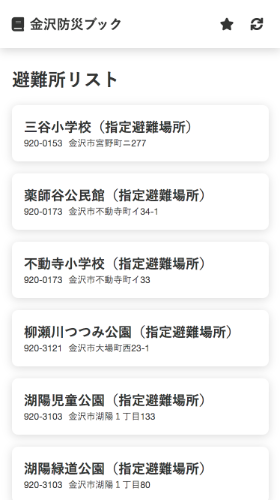

# 金沢防災ブック

> 金沢の防災情報を確認できるアプリケーション



## これは何？

大学の課題で作成したスマートフォン用の Web アプリケーションです。
担当教員が Node.js の環境を用意できない可能性やバンドルされたコードだと怪しまれる可能性を考慮して、webpack を用いないことにしました。

## 開発手順

```bash
$ git clone git@github.com:saitoeku3/kanazawa-bousai-book.git
$ cd kanazawa-bousai-book
$ npm ci
$ npm run serve
```
